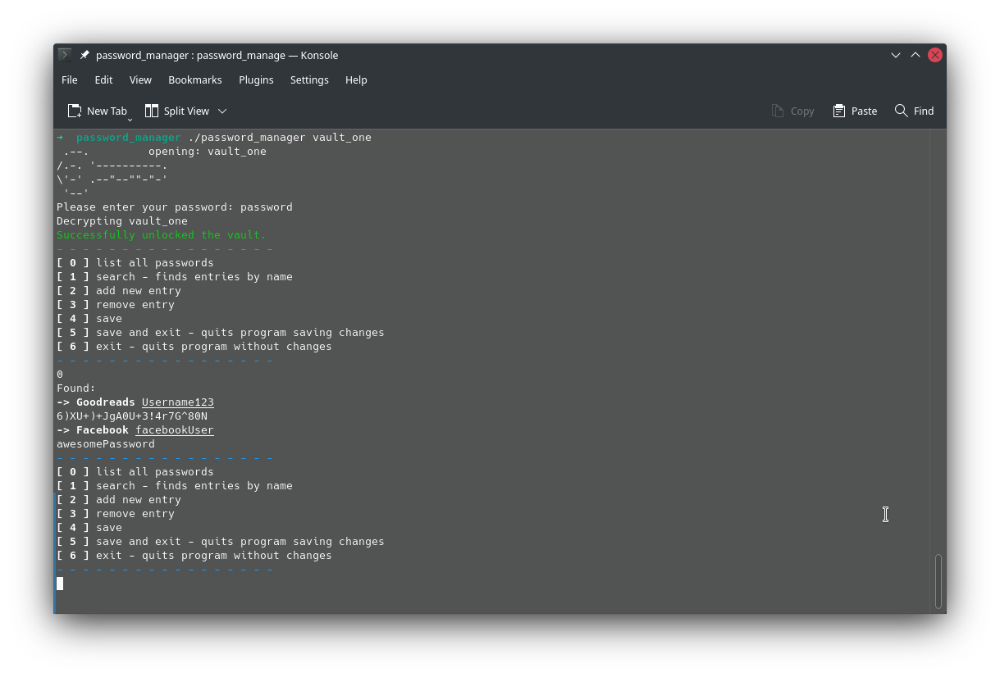

# Projekt c++
## Password manager
This is a basic terminal based password manager. It generates passwords, saves them to an encrypted xml file and provides some operations over them.
Upon opening, the user is asked to provide a password to decrypt the vault.

## Dependencies 
Encryption is handled by libsodium.
https://libsodium.gitbook.io/doc/  

XML parsing is handled by pugixml. (No extra steps required. Contained in source.)
https://github.com/zeux/pugixml

## Usage
> $ ./password_manager vaultFile

---

